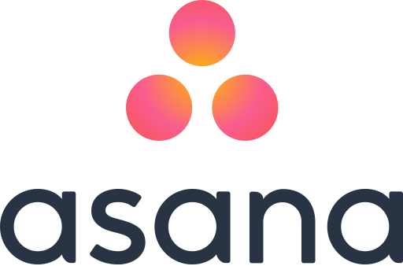
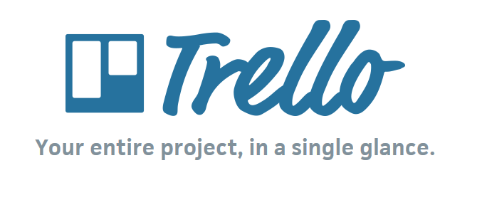
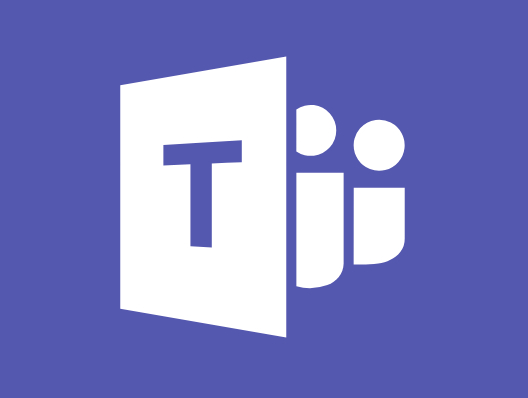
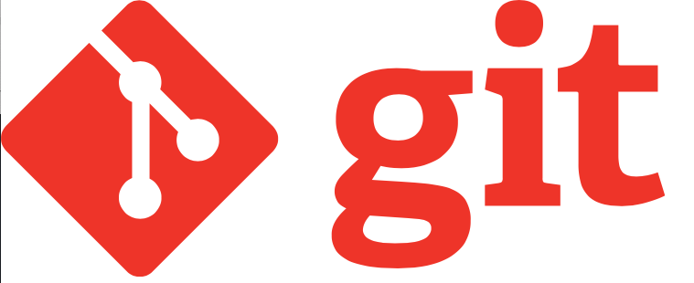

# Survey of tools

View slides here

One major consideration is whether a tool is hosted in Canada. This information is usually found in terms of service under a section that explicitly addresses "storage" or "data privacy". Make sure you are aware of the risks.

If a tool keeps data on US servers and does not have Canadian hosting options, do not share sensitive information using the tool.
* [This is what personally identifiable information is](https://isit.arts.ubc.ca/personally-identifiable-information).
* Always follow these guidelines from University Counsel.

The below list is by no means comprehensive and is meant to introduce you to a few tools that may be useful for your work.

## General workflow tools

* [OSF](https://osf.openscience.ubc.ca/)

  * The OSF is a powerful and flexible interdisciplinary workflow management tool.
  * UBC has OSF for institutions which means that UBC-affiliated OSF projects are brought together on a UBC landing page. You can also use your UBC credentials to log in to this tool.
  * OSF has unlimited overall project storage but individual files and objects need to be under 5GB in size. For larger items, OSF has many integrations with storage providers.
  * OSF allows for granular management of access to parts of an objects via "Components" feature.
  * Files uploaded to OSF are hosted on Canadian servers (if that option is selected while creating a repository).
  * Collaborators do not need to be at UBC to be added to a project and different "Components" can be hosted in different places (eg. other countries).
  * Projects can be private or public.
  * [Learn more and sign up via UBC login](https://guides.library.ubc.ca/OSF)

## Task tracking and project overviews

* [Asana](https://app.asana.com/)

  * Project management tool which can be used as a personal to-do list.
  * Free "limited" version is free indefinitely and fairly flexible.
    * Limited number of collaborators
    * Limited ways to view tasks: list, calendar, and KanBan board (todo, doing, done columns)
  * Can have many inter-related projects.
  * Information is hosted on US servers.
  * [Take a look at this excellent Youtube Playlist courtesy of the folks at Asana](https://www.youtube.com/playlist?list=PLJFG93oi0wJDMccrrEbbZha0v64Jo63K8)

* [Trello](https://trello.com/)

  * Project management tool which can be used as a personal to-do list.  
  * Can have many inter-related projects.
  * Free version is free indefinitely.
  * Has limited number of collaborators  
  * Information is hosted on US servers.
  * [Learn More with this excellent playlist from Trello](https://www.youtube.com/playlist?list=PL4H_oPRK80z5Rq0aBNxeeS5sVPyDrNXCh)

## Chatting with your team

* [Microsoft Teams](https://it.ubc.ca/services/email-voice-internet/microsoft-teams)

  * Free for UBC students, faculty, and staff).
  * UBC IT offers support with Teams.
  * Integrated with Microsoft Office suite.

* [Slack](https://slack.com/intl/en-ca/)

  * Chat tool for teams, not supported by UBC IT.
  * Commonly used in industry; useful to be aware of.
  * Free to use with limitations.
  * Hosted on US servers; not ideal for conversations about sensitive topics.

## Version control

* [Git](https://git-scm.com/)

  * Git is a version control tool that is the backbone of services like Github and GitLab.
  * It is fully open source and used widely in many different disciplines as well as in industry.
  * Git provides line by line versioning for text files, showing edits made, who made them, and when.
  * Works best with text files.

  * [GitHub](https://github.com/)
  
    * Owned by Microsoft.
    * US-hosted service that uses Git as a back-end.
    * Free to use with some constraints.
    * Free web hosting through Github Pages which runs off of a Github repository.
    * Github is designed to work with text files. This means files under 100MB (works best with files under 50mb). As a result it is not for large file storage.
      * That said, Github does offer a separate service called Github large file storage. This storage is not intended for research data or sensitive data and is on US servers.

  * [GitLab](https://about.gitlab.com/)
  
    * Open Source tool for the use of Git, similar to Github.
    * GitLab is an newer service but very useful for overall workflow management.

## Storage for files you're regularly updating

* OSF (again)

  * Lots of integrations for file storage providers via [OSF Add-Ons](https://www.cos.io/blog/osf-add-ons-help-you-maximize-research-data-storage-and-accessibility)
  * Unlimited total storage; individual files can be up to 5GB
  * Hosting of data uploaded to a project is on Canadian servers (in Montreal) but some data about the project (eg. project metadata and information about project collaborators) is stored on US servers.

* [OneDrive](https://it.ubc.ca/services/web-servers-storage/microsoft-onedrive)

  * Unlimited cloud storage available for free to UBC faculty, staff, and students as part of the Microsoft suite.
  * UBC IT offers support.

* [Box](https://www.box.com)

  * Unlimited file storage and no file type limitations.
  * [Not free past 14 day trial](https://www.box.com/pricing)
  * Canadian hosting options (unlike the similar service, DropBox which is US-based)
